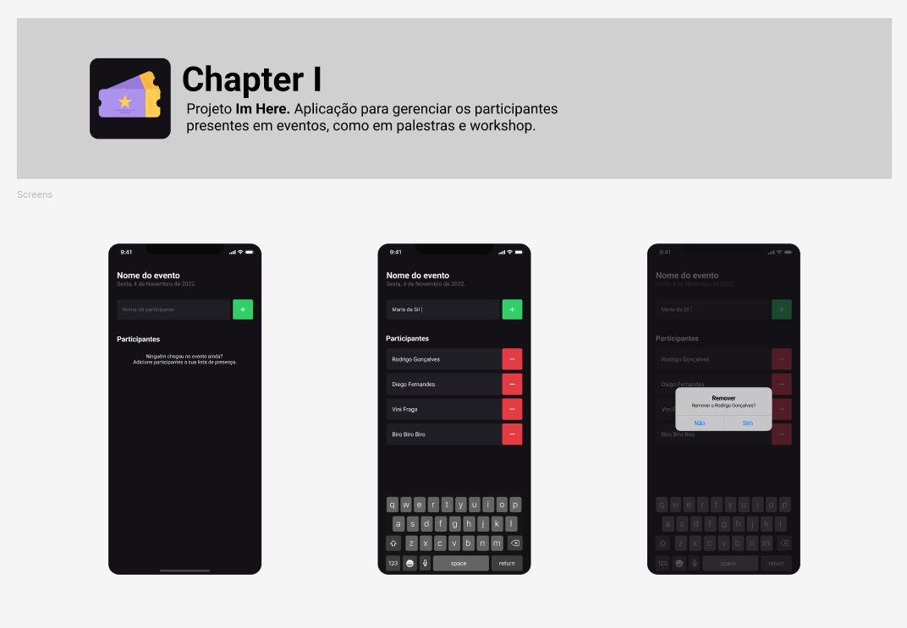
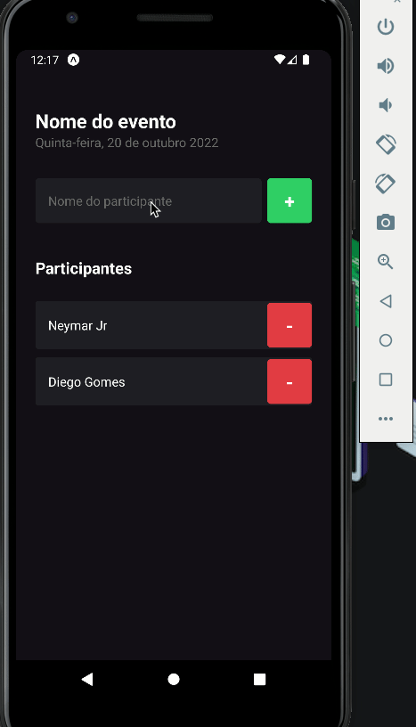

# Im Here

# Rocketseat Ignite React Native

Projeto Im Here da [Rocketseat](https://www.youtube.com/c/RocketSeat) para aprender os fundamentos
do React Native, essa aplicação parece ser simples. Mas podemos ver muitas coisas importante como: (
Componentes, Propriedades, useState, Typescript, FlatList e etc...)

## Requerimentos

- [Node](https://nodejs.org)
- [yarn](https://yarnpkg.com/getting-started/install) ou [npm](https://www.npmjs.com)
- Requerimentos do [React Native](https://reactnative.dev)

## Tech Stack

- [React](https://reactjs.org)
- [React Native](https://reactnative.dev)
- [TypeScript](https://www.typescriptlang.org)
- [date-fns](https://www.npmjs.com/package/date-fns)

## Im Here em funcionamento

